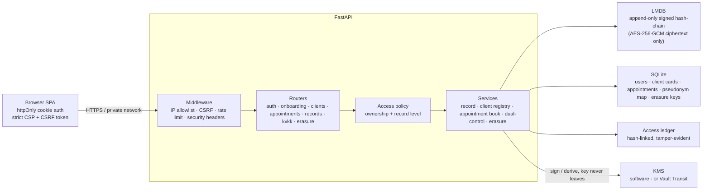
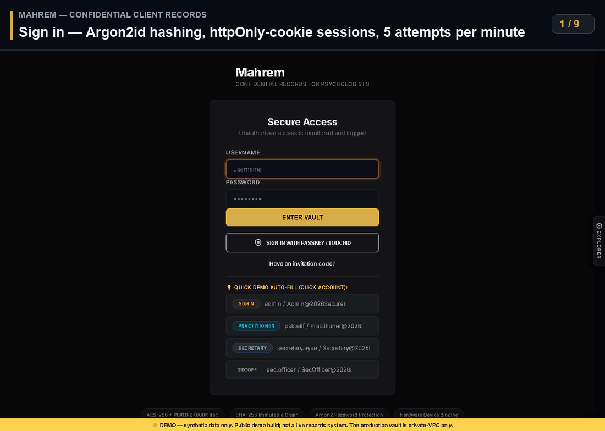
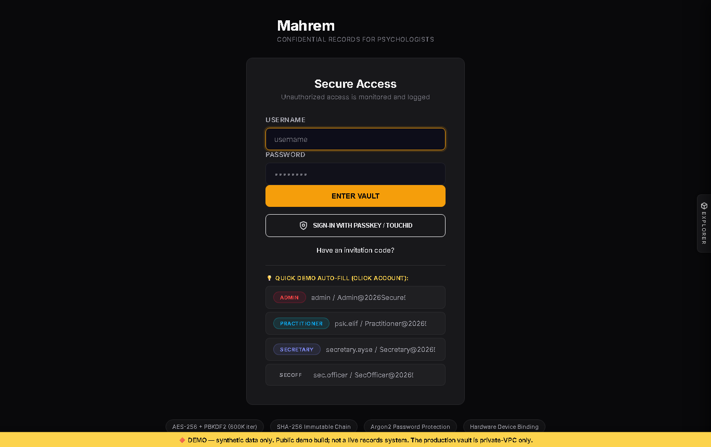
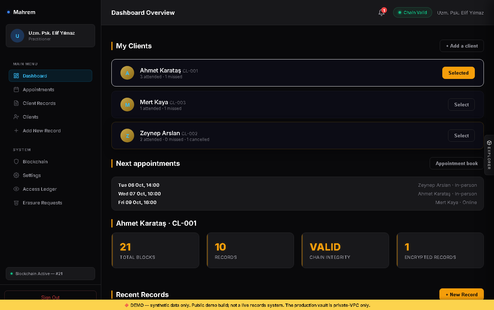
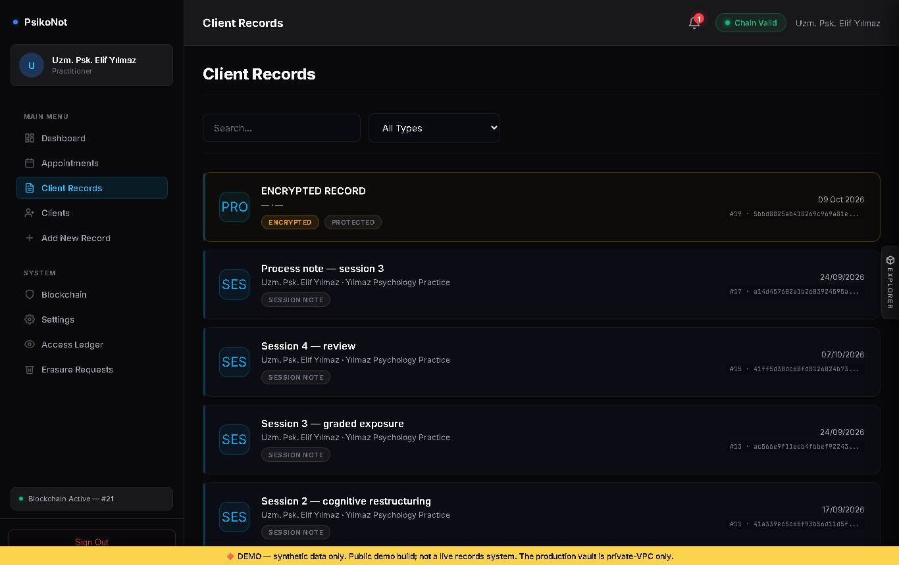
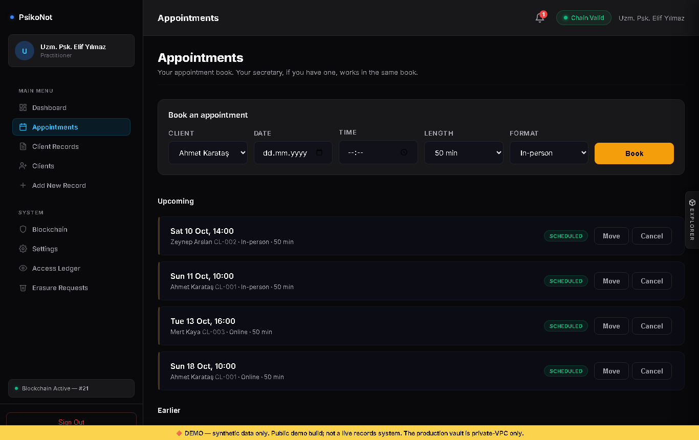
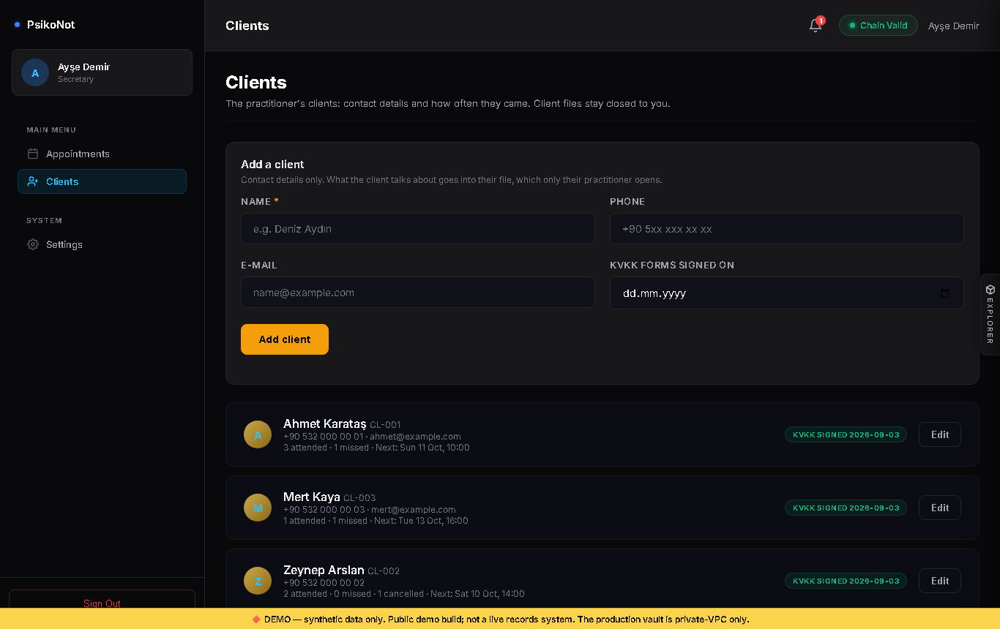
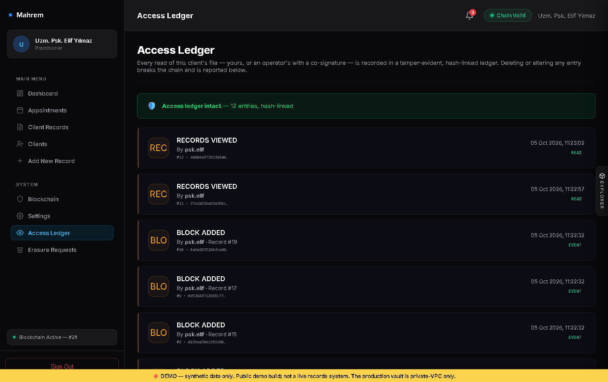

# Mahrem

> Confidential client records for independent psychologists. A FastAPI backend
> built around security engineering: **a client's file opens only for their own
> practitioner, one access policy on every endpoint, AES-256-GCM encryption at rest,
> a signed append-only hash-chain, a tamper-evident access ledger, passkeys and
> crypto-shredding erasure (KVKK/GDPR Art. 17)**, with **271 passing tests**.

*Mahrem* (Turkish: "private, not to be seen by others") is the pivot of an earlier
project, *VIP Health Vault*. The security core stayed; the domain became something
concrete: a psychologist in private practice, their secretary, and their clients.

## The problem

A practice needs two kinds of information, and they deserve different treatment:

1. **The practice log** — who the clients are, how to reach them, when their
   appointments are, who came and who did not. The secretary needs this every day.
2. **What was said in the sessions** — the client's problems, the session notes and
   transcripts. Only the practitioner who works with the client should ever read it:
   not the secretary, not another practitioner, not an administrator on their own.

Mahrem keeps the first one simple and puts the security engineering on the second.
It is not a booking or payment app: clients do not sign in.

## Roles

| Role | What they can do |
| :-- | :-- |
| **Practitioner** | Keeps their clients' cards and files. Writes the client profile, session notes, transcripts, treatment plans and homework — encrypted, and readable only by them. Runs the appointment book, marks who came. Exports a client's data and files an erasure request when the client asks. Invites their secretary. |
| **Secretary** | Works for one practitioner: adds clients and keeps their phone and e-mail up to date, books, moves and cancels appointments, marks who came. Sees the tally. Never sees a record, a note or a transcript. |
| **Admin / auditor / KVKK officer** | Run the system and provision practitioner accounts. Can read a client's records only with a dual-control co-signature from a second privileged person. Carry out erasure requests and see the security alerts. |

Clients have no accounts. Each client is a **card** owned by one practitioner: a client
ID (`CL-###`), name, phone, e-mail, and the date the KVKK forms (privacy notice and
explicit consent) were signed on paper.

## Access model

One module decides who sees what: [`core/services/access_policy.py`](core/services/access_policy.py)
([ADR-0003](docs/adr/0003-one-access-policy.md)). Every record endpoint calls it.

| | Client card and appointments | Client's file (records) |
| :-- | :-- | :-- |
| The client's practitioner | ✅ | ✅ |
| Their secretary | ✅ | ❌ never |
| Another practitioner | ❌ | ❌ |
| Admin / auditor / KVKK officer | ❌ | only with a co-signature from a second person |

**File level.** Anyone but the client's own practitioner gets `403` for everything in
the file — the same answer as for a client who does not exist, so client IDs cannot
be probed. **Default deny.** The policy lists the roles that may see records at all;
every other role, the secretary included, is refused.

A record can also be locked with its own password on top of the at-rest encryption,
so even the server cannot open it without the practitioner — the demo does this for a
session transcript.

## Security engineering at a glance

| Primitive | Implementation |
| :-- | :-- |
| **Access policy** | Pure functions, unit-tested without a database; file level by ownership, record level, default deny — [`core/services/access_policy.py`](core/services/access_policy.py) |
| **Encryption at rest** | AES-256-GCM, fresh 96-bit nonce per write, KMS-derived per-client key — [`core/kms/software_provider.py`](core/kms/software_provider.py) |
| **Integrity** | Append-only chain: each block links to the previous hash and carries an HMAC-SHA256 signature and Merkle root — [`core/services/record_service.py`](core/services/record_service.py) |
| **Corrections** | A record is never overwritten; a correction is a new block and the original stays readable — [`backend/routers/records.py`](backend/routers/records.py) |
| **Access ledger** | Hash-linked, tamper-evident log of every read; the practitioner sees who opened their client's file — [`database/audit_storage.py`](database/audit_storage.py) |
| **Dual control** | M-of-N co-signature before any operator reads a record — [`core/services/dual_control.py`](core/services/dual_control.py) |
| **Sign-in** | Argon2id passwords, WebAuthn/FIDO2 passkeys, TOTP, 5 attempts per IP per minute — [`core/webauthn.py`](core/webauthn.py), [`backend/middleware/rate_limiter.py`](backend/middleware/rate_limiter.py) |
| **Practice log** | Client cards and an appointment book with no free-text field, so nothing clinical ends up in the plain SQL tables — [`core/services/client_registry.py`](core/services/client_registry.py), [`core/services/appointment_book.py`](core/services/appointment_book.py) |
| **Onboarding** | No self-registration: single-use, expiring invitation codes stored only as a hash — [`backend/routers/onboarding.py`](backend/routers/onboarding.py) |
| **Pseudonymization** | The record store is keyed by an HMAC pseudonym, never the client ID — [`core/pseudonymization/service.py`](core/pseudonymization/service.py) |
| **KVKK** | Data export for the client (Art. 11), erasure requests that can be closed as done only after the key is really destroyed — [`backend/routers/kvkk.py`](backend/routers/kvkk.py) |
| **Right to erasure** | Crypto-shredding: destroying a client's key makes their records unreadable while the chain stays valid; the card and appointments are deleted — [`core/services/erasure_service.py`](core/services/erasure_service.py) |
| **Browser** | Output encoding at every HTML sink, strict CSP without inline script, httpOnly cookies, CSRF double-submit — [`docs/DOM_XSS_SELF_AUDIT.md`](docs/DOM_XSS_SELF_AUDIT.md) |

## Architecture



Why a local signed hash-chain and not a public blockchain: one practice, one trust
boundary, and confidentiality as the goal. A public chain would make the data
permanent and often public — the opposite of what therapy notes need
([ADR-0001](docs/adr/0001-offchain-storage-onchain-anchoring.md)). The app runs as a
single node on purpose ([ADR-0002](docs/adr/0002-single-node-deployment.md)).

## Interface

Captured from the Docker demo: the practitioner, the secretary, and an administrator
who cannot read anything on their own. Every frame is captioned.



| Sign in | Practitioner dashboard (clients with their tally, next appointments) |
| :---: | :---: |
|  |  |

| The client's file (only their practitioner opens it) | Appointment book (came / did not come) |
| :---: | :---: |
|  |  |

| Client cards — the secretary's view | Tamper-evident access ledger |
| :---: | :---: |
|  |  |

## Bugs I found and fixed

Each one was reproduced first, then fixed with a test that fails on the old code. The
full history is in the [CHANGELOG](CHANGELOG.md).

- **A new role would have read every record.** The access policy allowed every role
  other than client and practitioner, on the assumption that the rest were operators
  already stopped by dual control. Adding a secretary exposed it: before the fix, a
  secretary got record data or consent lists from six endpoints. The policy now lists
  the roles that may see records and denies everything else.
- **IDOR on the single-record endpoint.** `GET /records/{client}/{block}` only checked
  that a client stayed in their own file, so any practitioner could read any client's
  unprotected records by walking block numbers. The access rules had been copied into
  each endpoint and the copies drifted apart. Fixed by moving every rule into one
  policy module that all endpoints call.
- **The sign-in rate limit never applied.** It matched `/api/auth/login`, but the API
  lives under `/api/v1`, so passwords could be guessed without limit. It now covers
  password login, passkey login and invitation codes.
- **Practitioners could write into any client's file**, and read any client's chain
  status.
- **`MANDATORY_FIDO2` enforced nothing.** It returned a flag no code read, and only for
  some roles; every password login still worked. Now an account with a passkey must use
  it, for every role, and one without is taken straight to enrolment.
- **CI had not run the tests for a month.** Since 21 August a lint error failed the
  first step, so every later step was skipped; a red build that "always fails" hid that
  nothing was being tested.
- **Stored XSS** in the confidential-record and attachment views (a crafted file name,
  or a quote in the file type inside ``), found in a second,
  line-by-line self-audit after a first one had missed them. The CI guard changed from
  a denylist to a rule: every untrusted `${…}` must be escaped or explicitly reviewed.
- **Reflected DOM XSS** in the command palette's search box.
- **Passkey login accepted any known credential** without verifying the assertion.
- **A fake "anchor"** — a random number presented as a transaction hash — replaced by a
  real HMAC signature of the Merkle root.
- **Opening a file got slower with every record.** All blocks of a client's file share
  one key, but it was derived again (600,000 PBKDF2 iterations) for every block: 30
  records took 4 s, a file of 1,151 blocks about 2 minutes. A request now derives it
  once — 30 records in 0.15 s, 1,151 blocks in under a second. A test counts the
  derivations so it cannot come back.
- **Silent audit-log overwrite**: ledger entries were keyed on `time.time_ns()`, whose
  resolution on Windows is ~15.6 ms, so two reads in one tick overwrote each other.

**Honest limits.** The design assumes the attacker knows the code and can reach the
service. Within that, keys can live on the app host, tampering is *detected* rather
than prevented, there is no high availability, and there has been no external
penetration test.
The full list is in [THREAT_MODEL.md](docs/THREAT_MODEL.md#4-trust-assumptions--residual-risk).

## Quick start

Requires Python 3.10+.

```bash
git clone https://github.com/calsgnkadir/mahrem.git
cd mahrem
pip install -r requirements.txt
ENVIRONMENT=development VHV_DEMO_MODE=true python -m uvicorn backend.main:app --host 127.0.0.1 --port 8000
```

Or with Docker:

```bash
docker compose -f docker-compose.yml -f docker-compose.demo.yml up --build
```

Then open `http://127.0.0.1:8000`.

### Demo accounts

Demo mode seeds these accounts, three client cards (`CL-001` to `CL-003`) and a few
weeks of the appointment book. `CL-001` has an example file: five weeks of CBT for
panic on the commute — the client profile, treatment plan, session notes, homework, a
process note and a session transcript locked with the password `DemoRecord@2026!`.
Nothing is seeded outside demo mode, and an existing file is never overwritten.

| Account | Password | Shows |
| :--- | :--- | :--- |
| `psk.elif` | `Practitioner@2026!` | the dashboard with the tally, client files, the access ledger |
| `secretary.ayse` | `Secretary@2026!` | the appointment book and client cards — and nothing from any file |
| `admin` | `Admin@2026Secure!` | records locked by dual control until a second person co-signs |
| `sec.officer` | `SecOfficer@2026!` | the co-signing side of dual control, erasure requests |

The app is meant for a private network. Demo mode relaxes that (IP allowlist off,
auto-generated key), so never use it for real records — see
[PRIVATE_VPC_DEPLOYMENT.md](docs/PRIVATE_VPC_DEPLOYMENT.md).

## Tests

```bash
pip install -r requirements-dev.txt
python -m unittest discover -s tests -p "test_*.py"
```

CI runs Ruff, Bandit and the full suite on Python 3.10 and 3.11. Locally, point the
stores at a scratch folder so old test data does not slow the run down:
`VHV_SQLITE_PATH=/tmp/t.db VHV_PROJECTS_DIR=/tmp/t-projects`.

## Documentation

- [Threat model](docs/THREAT_MODEL.md) · [DOM XSS self-audit](docs/DOM_XSS_SELF_AUDIT.md) · [Onboarding](docs/ONBOARDING_PROTOCOL.md)
- [KVKK / GDPR compliance](docs/GDPR_KVKK_COMPLIANCE.md) · [DPIA](docs/DPIA.md)
- [Key management](docs/KEY_MANAGEMENT.md) · [Key rotation runbook](docs/KEY_ROTATION_RUNBOOK.md)
- Decisions: [ADR-0001](docs/adr/0001-offchain-storage-onchain-anchoring.md) · [ADR-0002](docs/adr/0002-single-node-deployment.md) · [ADR-0003](docs/adr/0003-one-access-policy.md)

## Roadmap

| Status | Item |
| :---: | :--- |
| ✅ | One access policy: a client's file opens only for their practitioner |
| ✅ | Client cards with the tally; appointment book with a secretary who never sees records |
| ✅ | KVKK: data export, erasure requests, security alerts |
| ✅ | Encryption at rest, signed hash-chain, access ledger, crypto-shred erasure |
| ✅ | Long files open fast: one key derivation per request instead of per block |
| 📋 | External anchoring of the Merkle root (RFC 3161 timestamp) |
